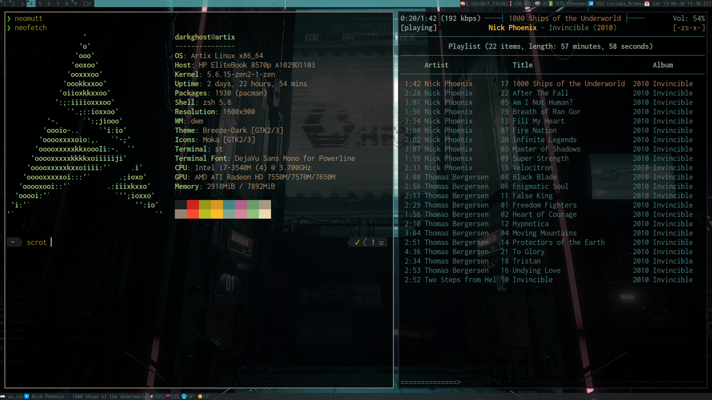

# My dotfiles

Right now present:
- Xdefaults
- vimrc
- zshrc + oh-my-zsh
- bashrc
- mpd configs
- xinitrc
- sxhkdrc
- dwm

## dwm autoexec folder

Inside you will find my statusbar updaters ( for my dwmblocks build )

## bin

My sctipts and apps, dont use a lot of them. Note the `statusbar` folder with all scripts for dwmblocks

**If any of them break your system don't blame me pls.**

Have fun
